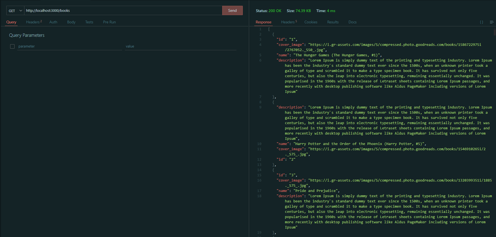
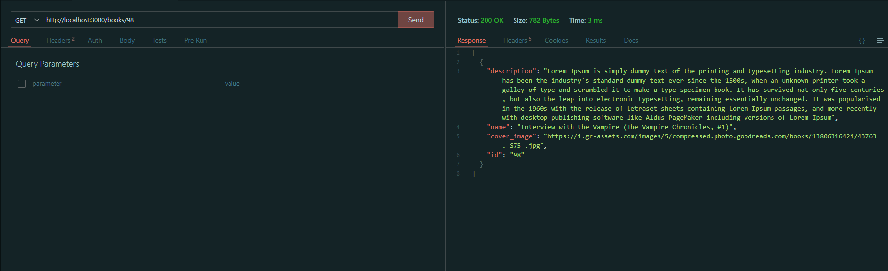
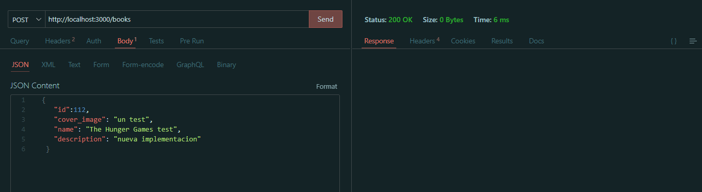
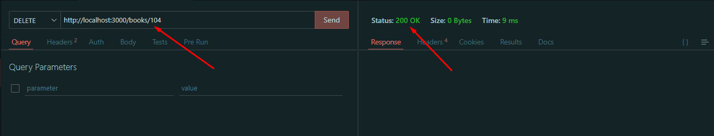

# Rest-Api-Crow-Postgress-C

## Run project
* 1 - Have docker installed
* 2 - Run command `docker-compose up`
* 3 - On your browser you should be able to access `http://localhost:3000/`

## References
 * [GET] http://localhost:3000/
    ### Response
    

 * [GET] http://localhost:3000/books
     ### Response
    
 * [GET] http://localhost:3000/books/<book_id>
      ### Response
    
 * [POST] http://localhost:3000/books
      ### Response
    
 * [DELETE] http://localhost:3000/books/<book_id>
      ### Response
    

### Research
 
| Link                  | Description                                                                             |
| ------------------------ | --------------------------------------------------------------------------------------- |
|   Using env files | **https://en.cppreference.com/w/cpp/utility/program/getenv** |
|  setting env files on linux | **https://www.freecodecamp.org/news/how-to-set-an-environment-variable-in-linux/** |
| delete env variable on linux | **https://www.linuxowindows.com/como-eliminar-una-variable-de-entorno-en-linux/** |
|   from char* to string | **https://www.geeksforgeeks.org/convert-char-to-string-in-cpp/** |
|   cast from complex string to c string  | **https://stackoverflow.com/questions/7352099/stdstring-to-char** |
|   crow http lib  | **https://crowcpp.org/master/** |
|   Header guards  | **https://www.learncpp.com/cpp-tutorial/header-guards/** |